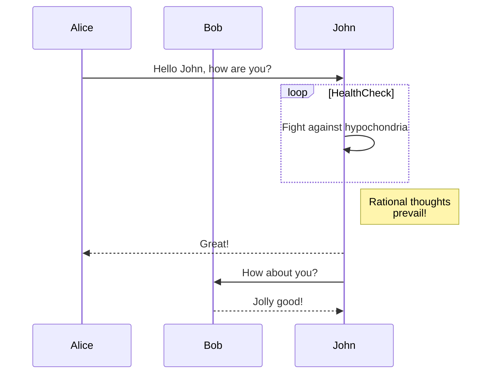
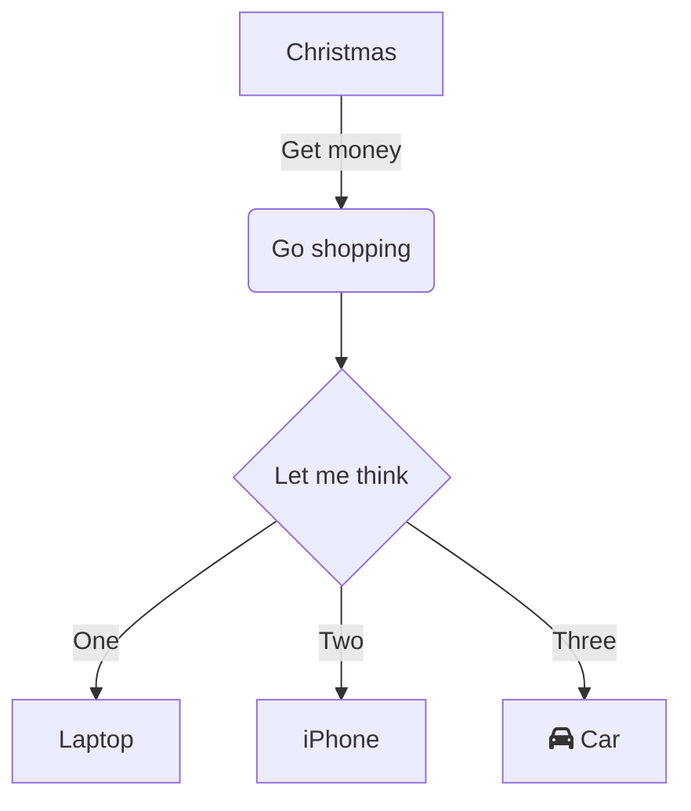

# Create a Diagram with Mermaid

Diagramming and charting tool with [Mermaid](https://mermaid.js.org/)

## Example Mermaid diagram

[Sequence diagrams](https://mermaid.js.org/syntax/sequenceDiagram.html)

[Mermaid Live Editor](https://mermaid.live/edit)

